<div align="center">


[](https://github.com/IMOitself/personal-github-banner/blob/master/redirect-to-recent-repo.html)

## strictly no vibe coding:D 

</div>

made from scratch! my own personalized banners for displaying anything github related to boost productivity

<details>
<summary>
        
## running locally
        
</summary>

- create a `.env` file
- put this into your `.env` file and change `your_access_token_here` to your access token:
    ```
    ACCESS_TOKEN=your_access_token_here
    ```
- run this to install dependencies
    ```
    pip install requests python-dotenv pathlib
    ```
- run the python file
    ```
    python main.py
    ```
- **(optional)** for installing autocomplete and intellisense when editing graphql files:
    <br>install [GraphQL: Language Feature Support](https://open-vsx.org/vscode/item?itemName=GraphQL.vscode-graphql) extension.

</details> 
<details>
<summary>
    
## concept art
            
</summary>
    

</details>

##### Todo: steps on how to add redirect to recent repo to recent repo banner
